# mlframework

Neural network framework implemented from scratch in C++20.

## Features

- N-dimensional tensors with stride-based memory layout
- Automatic differentiation via dynamic computation graph
- **CUDA backend** with cuBLAS-accelerated matrix multiplication
- Module base class with recursive `to(Device)`, `parameters()`, `zero_grad()`
- Optimizers: SGD (momentum), Adam
- Layers: Linear, BatchNorm1d, Dropout, Conv2d, MaxPool2d, ReLU, Sigmoid
- Loss: Cross-entropy with fused softmax backward
- DataLoader: IDX parsing and shuffle
- LR Scheduling: Cosine Annealing with Warm Restarts
- Model serialization: save/load architecture, weights, and BatchNorm running stats

## Project Structure

```
include/mlframework/   Public headers
src/                   Implementations
src/cuda/              CUDA kernels
tests/                 Unit tests
cli/                   Training CLI
data/mnist/            MNIST dataset (not tracked)
models/                Saved models (not tracked)
```

### CLI flags

| Flag | Default | Description |
|------|---------|-------------|
| `--model` | `mlp` | Architecture: `mlp` or `cnn` |
| `--device` | `cpu` | Device: `cpu` or `cuda` |
| `--epochs` | `5` | Number of training epochs |
| `--batch` | `64` | Batch size |
| `--lr` | `0.001` | Initial learning rate |
| `--data` | `data/mnist` | Path to dataset directory |
| `--save` | — | Save model to path after training |
| `--load` | — | Load model from path to evaluate or continue training |
| `--eval-only` | — | Skip training, evaluate loaded model |

## Dependencies

```bash
sudo apt update
sudo apt install libopenblas-dev nvidia-cuda-toolkit
```

## Dataset Setup

```bash
mkdir -p data/mnist
cd data/mnist

wget https://storage.googleapis.com/cvdf-datasets/mnist/train-images-idx3-ubyte.gz
wget https://storage.googleapis.com/cvdf-datasets/mnist/train-labels-idx1-ubyte.gz
wget https://storage.googleapis.com/cvdf-datasets/mnist/t10k-images-idx3-ubyte.gz
wget https://storage.googleapis.com/cvdf-datasets/mnist/t10k-labels-idx1-ubyte.gz

gunzip *.gz
```

## Build

```bash
# Debug
cmake --preset debug && cmake --build --preset debug

# Test
./build/debug/tests

# Release
cmake --preset release && cmake --build --preset release
```

## Usage

### Train

```bash
# MLP on CPU
./build/release/mlframework --model mlp --epochs 15 --batch 64 --lr 0.001 --save models/mnist_mlp_v1.mlf
```
<details>
<summary>Output</summary>

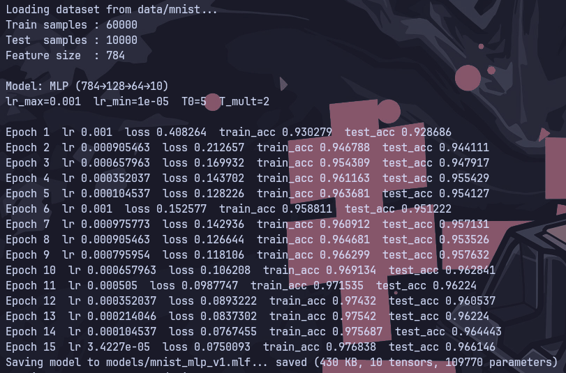

</details>

```bash
# MLP on CUDA
./build/release/mlframework --model mlp --device cuda --epochs 15 --batch 64 --lr 0.001 --save models/mnist_mlp_v2.mlf
```
<details>
<summary>Output</summary>

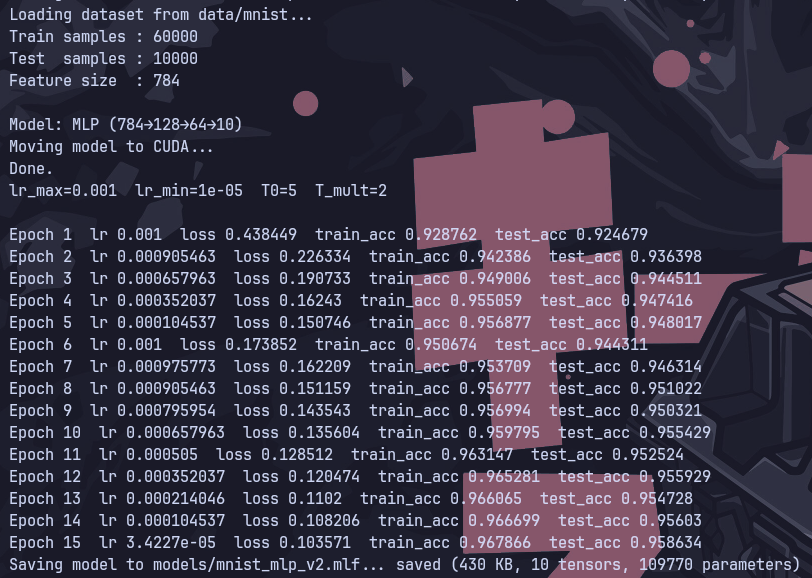

</details>

```bash
# CNN on CPU
./build/release/mlframework --model cnn --epochs 5 --batch 64 --lr 0.001 --save models/mnist_cnn_v1.mlf
```
<details>
<summary>Output</summary>

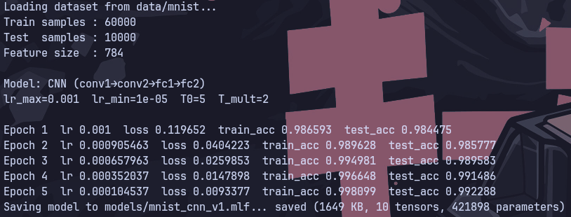

</details>

```bash
# CNN on CUDA
./build/release/mlframework --model cnn --device cuda --epochs 5 --batch 64 --lr 0.001 --save models/mnist_cnn_v2.mlf
```
<details>
<summary>Output</summary>

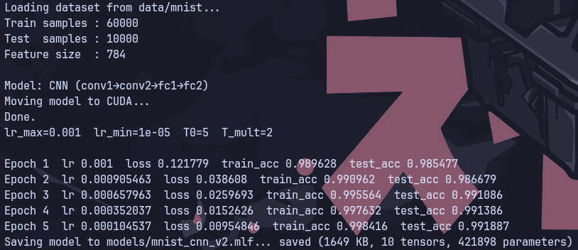

</details>

### Evaluate

```bash
# Evaluate on test dataset
./build/release/mlframework --load models/mnist_mlp_v1.mlf --eval-only
```
<details>
<summary>Output</summary>

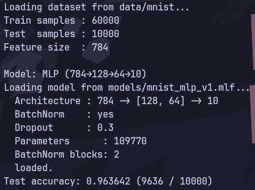

</details>

```bash
./build/release/mlframework --load models/mnist_mlp_v2.mlf --eval-only
```
<details>
<summary>Output</summary>

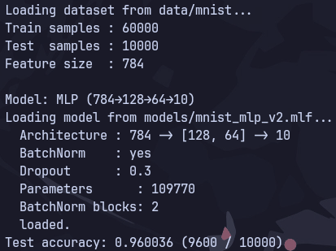

</details>

```bash
./build/release/mlframework --load models/mnist_cnn_v1.mlf --model cnn --eval-only
```
<details>
<summary>Output</summary>

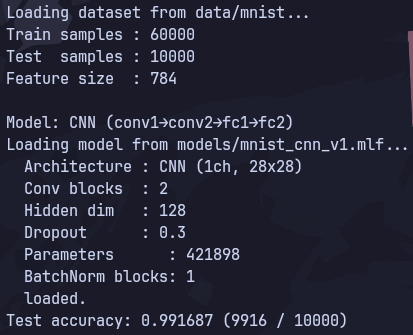

</details>

```bash
./build/release/mlframework --load models/mnist_cnn_v2.mlf --model cnn --eval-only
```
<details>
<summary>Output</summary>

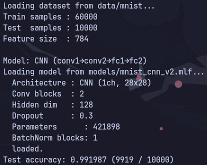

</details>

### Continue training

```bash
# MLP from CPU to CPU
./build/release/mlframework --load models/mnist_mlp_v1.mlf --epochs 10 --save models/mnist_mlp_v3.mlf
```
<details>
<summary>Output</summary>

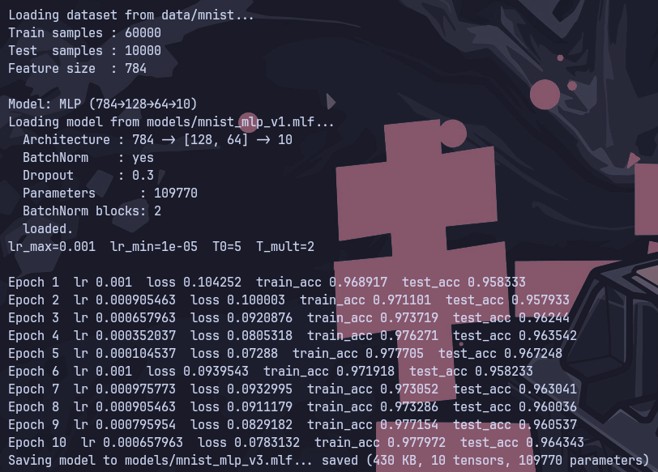

</details>

```bash
# MLP from CPU to CUDA
./build/release/mlframework --load models/mnist_mlp_v1.mlf --device cuda --epochs 10 --save models/mnist_mlp_v4.mlf
```
<details>
<summary>Output</summary>


</details>

```bash
# MLP from CUDA to CUDA
./build/release/mlframework --load models/mnist_mlp_v2.mlf --device cuda --epochs 10 --save models/mnist_mlp_v5.mlf
```
<details>
<summary>Output</summary>

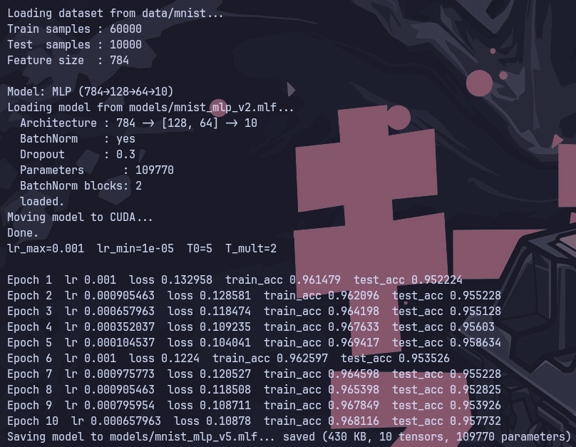

</details>

```bash
# MLP from CUDA to CPU
./build/release/mlframework --load models/mnist_mlp_v2.mlf --epochs 10 --save models/mnist_mlp_v6.mlf
```
<details>
<summary>Output</summary>

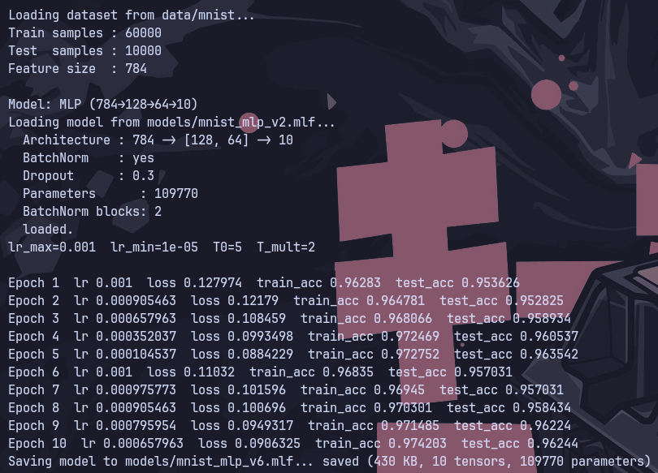

</details>

```bash
# CNN from CPU to CPU
./build/release/mlframework --load models/mnist_cnn_v1.mlf --model cnn --epochs 5 --save models/mnist_cnn_v3.mlf
```
<details>
<summary>Output</summary>

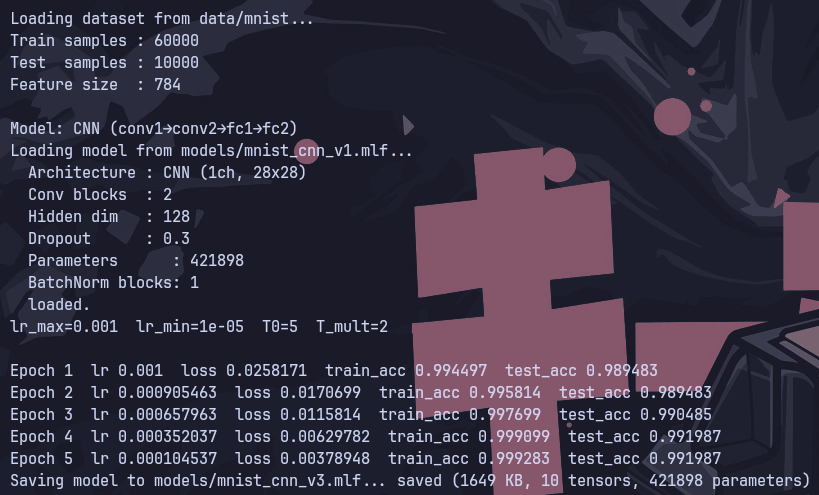

</details>

```bash
# CNN from CPU to CUDA
./build/release/mlframework --load models/mnist_cnn_v1.mlf --model cnn --device cuda --epochs 5 --save models/mnist_cnn_v4.mlf
```
<details>
<summary>Output</summary>


</details>

```bash
# CNN from CUDA to CUDA
./build/release/mlframework --load models/mnist_cnn_v2.mlf --model cnn --device cuda --epochs 5 --save models/mnist_cnn_v5.mlf
```
<details>
<summary>Output</summary>

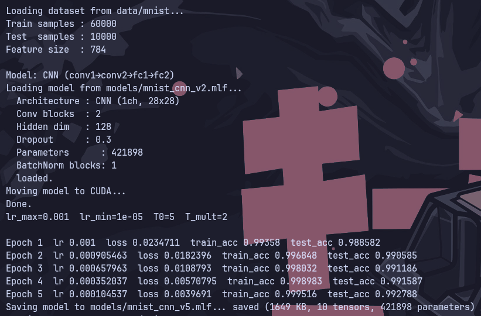

</details>

```bash
# CNN from CUDA to CPU
./build/release/mlframework --load models/mnist_cnn_v2.mlf --model cnn --epochs 5 --save models/mnist_cnn_v6.mlf
```
<details>
<summary>Output</summary>

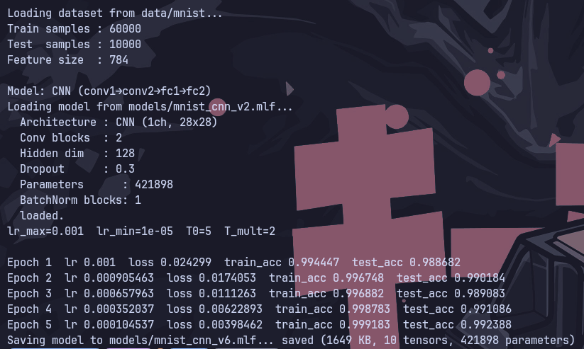

</details>